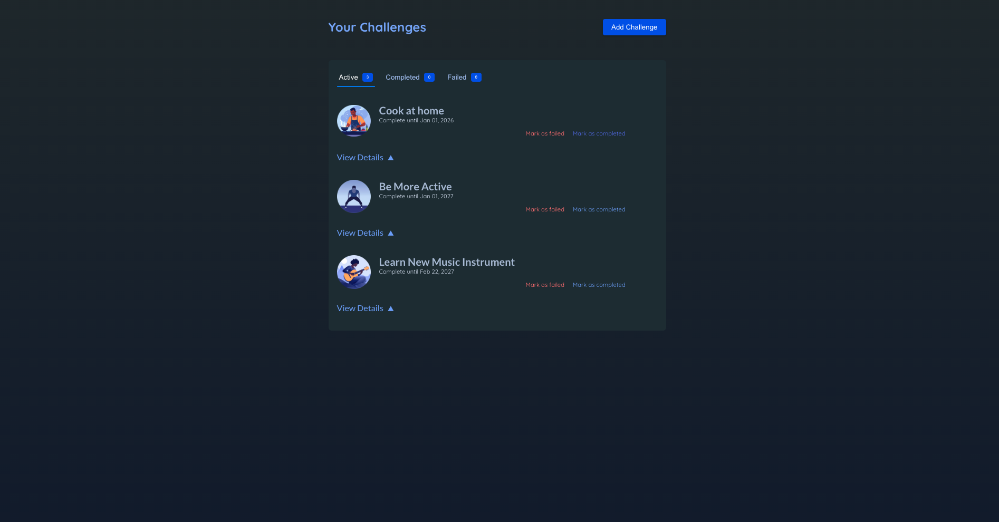
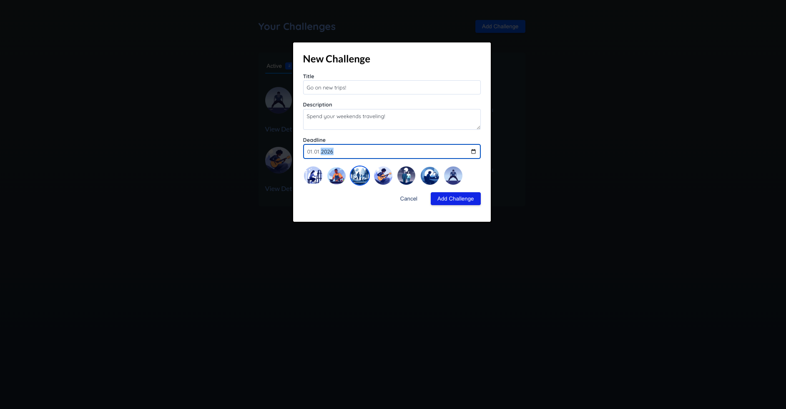
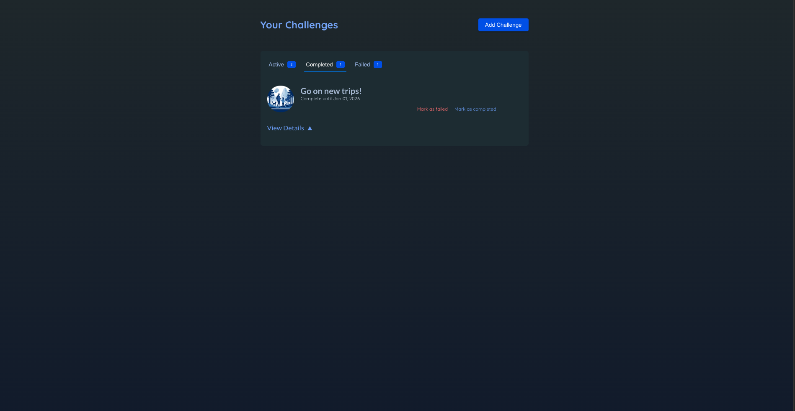

# 🎯 React Target Notes App

<p align="center">
  <strong>A simple and user-friendly goal tracking application built with React and Vite.</strong>
</p>

<p align="center">
  Create goals • Track progress • Mark success or failure
</p>

---
<p align="center">
  
  
  
  
</p>
---
## 🧩 Overview

**React Target Notes App** is a lightweight web application that allows users to create,
track, and manage their personal goals as notes. Users can add new goals, view them in
a list, and mark each goal as **successful** or **unsuccessful**.

The project focuses on applying modern frontend development practices such as
component-based architecture, state management with React Hooks, and clean UI design.

---

## 🚀 Features

- Add new goals
- View and manage a list of goals
- Mark goals as successful or unsuccessful
- Clean and minimal user interface
- Fully responsive layout

---

## 🛠️ Technologies Used

- **React** (Functional Components & Hooks)
- **Vite** (Fast development environment)
- **JavaScript (ES6+)**
- **HTML5**
- **CSS3**
- **ESLint** (Code quality)
- **Git & GitHub** (Version control)

---

## ▶️ Installation & Run

To run the project locally, follow these steps:

```bash
npm install
npm run dev
